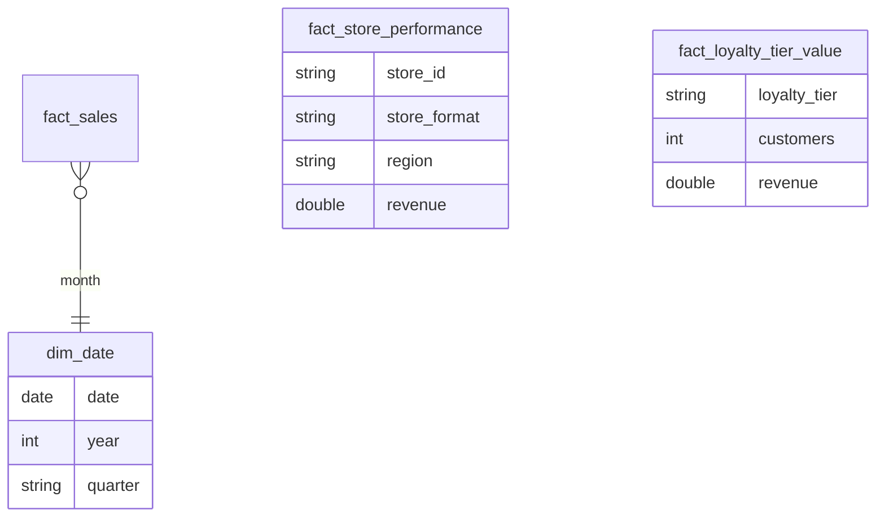

# Power BI Semantic Model — Retail & Loyalty Intelligence

`model.tmdl` defines the semantic model in **TMDL** (Tabular Model Definition Language) — the same format Power BI Desktop's Git integration uses, so this file is what would actually live in source control for a real Power BI project connected to Azure DevOps/GitHub.

## Why DirectLake, not Import or DirectQuery

| Mode | Refresh needed? | Query speed | Used here? |
|---|---|---|---|
| Import | Yes, scheduled | Fastest (in-memory) | No |
| DirectQuery | No | Slower (live query to source) | No |
| **DirectLake** | **No** | **Near-Import speed** | **Yes** |

DirectLake reads the Delta Parquet files in `gold/` directly from OneLake — no copy, no refresh schedule, no stale-data window. The moment Databricks notebook `03_gold_aggregate.py` finishes a write, the next Power BI query sees it. This is the main reason Fabric pairs with Databricks/Synapse for this kind of platform instead of a traditional Import model.

## Star Schema

## Key DAX Measures

- **`Gross Margin %`** — `DIVIDE(gross_margin, revenue)`, used on every executive page since raw margin Rand value means nothing without the rate
- **`YoY Revenue Growth %`** — uses `SAMEPERIODLASTYEAR`, the standard time-intelligence pattern, requires `dim_date` to be marked as the model's date table (`isDateTable` in the TMDL)
- **`Revenue per Loyalty Customer`** — the metric loyalty/CRM teams actually act on, not raw tier revenue, since tier sizes differ hugely (Bronze has 6x more customers than Platinum)

## Perspectives

Two perspectives narrow the field list for non-technical users:
- **ExecutiveSummary** — revenue and loyalty value only, no store-level operational noise
- **StoreOperations** — store performance + calendar, for regional ops managers

## Connecting to the local engine output

When running the pipeline locally (`engine/medallion_pipeline.py`), the Gold CSVs land in `data/lakehouse/gold/`. To explore them in Power BI Desktop without a Fabric workspace, use **Get Data → Text/CSV** against those files directly — the DAX measures above work identically against an Import model built on the same CSVs, which is a reasonable way to demo this semantic model without Azure access.
