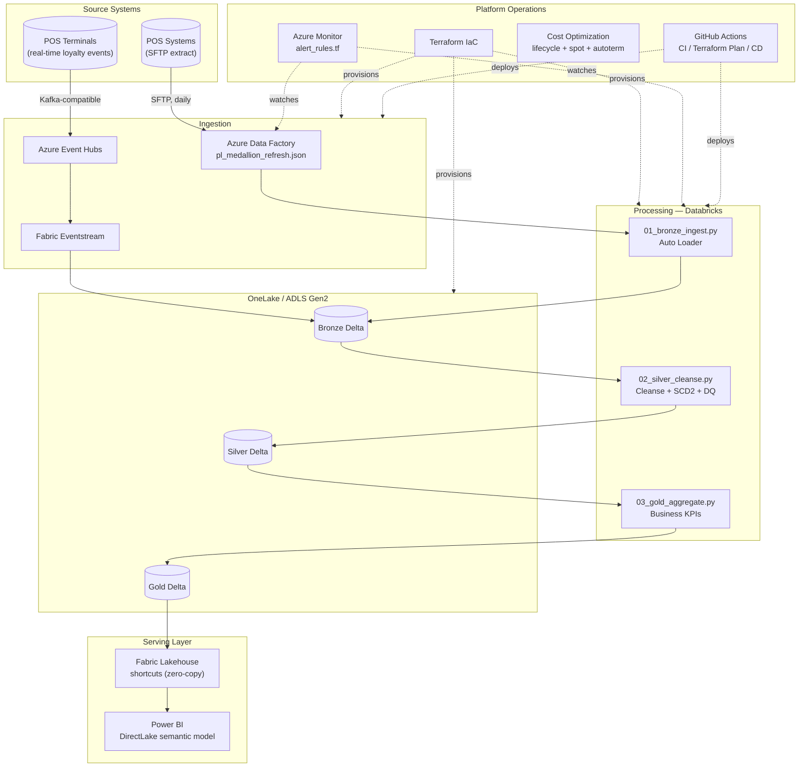

# Enterprise Retail & Loyalty Intelligence Platform


**[← Back to live portfolio](https://andiswamatai.github.io)**

A signature, end-to-end Azure data platform: Azure Data Factory orchestrating Databricks medallion notebooks writing Delta tables that Microsoft Fabric exposes to Power BI via DirectLake — with the infrastructure, data quality, monitoring, cost optimization, and CI/CD that turn a pipeline into a production platform, not a demo script.

This is the most architecturally complete repository in my portfolio. Where my other projects each prove one engineering skill in isolation (reconciliation logic, fraud rules, medallion patterns), this one shows how those skills compose into a single governed system, end to end.

## Why this exists

Most portfolio projects show a pipeline. They don't show what it actually takes to run that pipeline safely in an organisation: who gets paged when it breaks, what stops a bad record from reaching a board report, what the infrastructure costs and how that's controlled, and how a change gets from a developer's laptop to production without someone manually clicking through the Azure portal. This repository answers all of those questions with real artifacts, not just a paragraph in a README.

## Architecture



## What's actually runnable vs. what's reference architecture

Being upfront about this, the same way I would in an interview:

| Component | Status |
|---|---|
| `engine/` — full medallion pipeline (Bronze→Silver→Gold) | **Runs locally**, pandas, no cloud account needed |
| `data_quality/` — completeness, uniqueness, referential integrity, freshness | **Runs locally**, tested |
| `cost_optimization/cost_calculator.py` | **Runs locally**, models real savings from the Terraform config |
| `tests/` | **Runs locally**, 8 passing unit tests |
| `terraform/*.tf` | **Valid HCL**, `terraform validate`-able, not applied (no Azure subscription) |
| `databricks/notebooks/*.py` | **Valid PySpark**, written exactly as it would run in a Databricks workspace, mirrors `engine/` 1:1 |
| `adf/`, `fabric/` JSON | **Valid JSON**, matches the real ADF/Fabric REST API schema |
| `monitoring/alert_rules.tf` | **Valid HCL**, KQL queries written against real Log Analytics table schemas |
| `.github/workflows/cd.yml` | **Documents the real deployment commands**, doesn't execute them against live infra |

## Repository Structure

```
engine/                  Local-runnable medallion pipeline (the proof it works)
databricks/notebooks/    Production PySpark notebooks (1:1 mirror of engine/)
adf/                     Pipeline, dataset, and linked service definitions
fabric/                  Eventstream + Lakehouse shortcut configs
terraform/               Full IaC: storage, ADF, Databricks, Key Vault, budget
monitoring/              Azure Monitor alert rules + reference KQL queries
cost_optimization/       Working cost model + the controls it measures
powerbi/                 TMDL semantic model + DAX measures
data_quality/            Standalone DQ framework (completeness/unique/RI/freshness)
tests/                   Unit tests for engine + DQ framework
.github/workflows/       CI, Terraform Plan, CD
```

## Running the local pipeline

```bash
pip install -r requirements.txt
python engine/generate_sample_data.py     # ~6s, ~590K rows
python engine/medallion_pipeline.py       # ~7s, full Bronze→Silver→Gold
python data_quality/run_dq_suite.py       # DQ gate — same checks as production
python cost_optimization/cost_calculator.py
```

Run the tests:

```bash
python -m unittest discover -s tests -v
```

## Sample Output

```
LOYALTY TIER VALUE
loyalty_tier  customers      revenue  avg_basket
      Bronze      18177 199371054.25     1099.40
        Gold       7139  78011617.73     1100.26
    Platinum       2708  29456431.62     1100.11
      Silver      11976 131510358.18     1101.66

DATA QUALITY: 0 of 6 checks failed. Gold layer is safe to publish to Power BI.

COST OPTIMIZATION:
  Storage lifecycle tiering savings:  R510.00/month   (55.9%)
  Databricks spot instance savings:   R5,747.70/month (59.5%)
  TOTAL ESTIMATED ANNUAL SAVINGS:     R76,196.40
```

## Production readiness checklist

- [x] Infrastructure as Code (Terraform, environment-separated via `.tfvars`)
- [x] CI/CD (GitHub Actions: test → plan → deploy, with a DQ smoke test gate)
- [x] Data quality enforced as a pipeline gate, not an afterthought
- [x] Monitoring & alerting (3 distinct alert rules, tiered by severity)
- [x] Cost optimization (storage tiering, spot compute, autotermination — all measured)
- [x] Secrets via Key Vault references, never in source control
- [x] Managed identity auth between ADF, Databricks, and storage — no stored credentials
- [x] SCD Type 2 dimension for full historical accuracy
- [x] Real-time + batch ingestion paths, converging into one Silver table
- [x] Semantic layer (Power BI DirectLake) with documented DAX and perspectives

## License

MIT — all data is synthetic.
